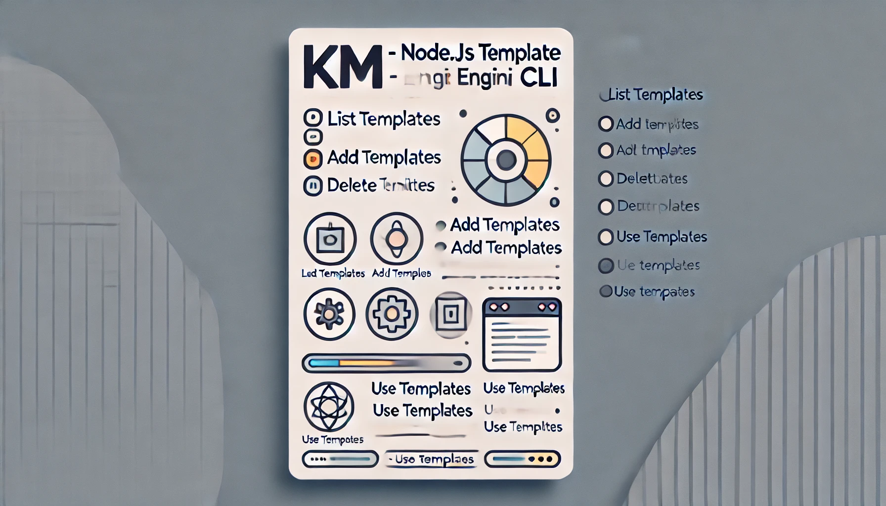

# KM - A Template Engine CLI



A simple CLI tool to manage templates in your project. This CLI allows you to list, add, delete, and use templates seamlessly.

## Features

- List available templates.
- Add a new template (file or folder) with a name, description, and path.
- Delete an existing template by its name.
- Use a template by copying it to the current directory.
- Displays a progress bar for the template usage.

## Installation

1. Clone the repository:
   ```bash
   git clone https://github.com/kartikmehta8/km-engine-cli.git
   ```

2. Navigate to the project directory:
   ```bash
   cd km-engine-cli
   ```

3. Install the dependencies:
   ```bash
   npm install
   ```

## Usage

### List Templates

To list all available templates with their descriptions, run:

```bash
node index.js list
```

**Example:**

<p align="center">
   
</p>

### Add a Template

To add a new template, use the `add` command. It will prompt you to enter the template's name, description, and file/folder path.

```bash
node index.js add
```

**Example:**

<p align="center">
   
</p>

### Delete a Template

To delete a template by its name, use the `delete` command:

```bash
node index.js delete <template_name>
```

**Example:**

<p align="center">
   
</p>

### Use a Template

To use a template by copying it to your current directory, run:

```bash
node index.js use <template_name>
```

**Example:**

<p align="center">
   
</p>

### Help Command

To view all available commands and descriptions, run:

```bash
node index.js help
```

**Example:**

<p align="center">
   
</p>

## Project Structure

```bash
├── src
│   ├── commands        # Contains all the CLI commands.
│   ├── config          # Configuration files for paths, etc.
│   ├── utils           # Utility functions used across the project.
│   └── templates.json  # Stores all template metadata.
└── index.js            # Main entry point for the CLI.
```
